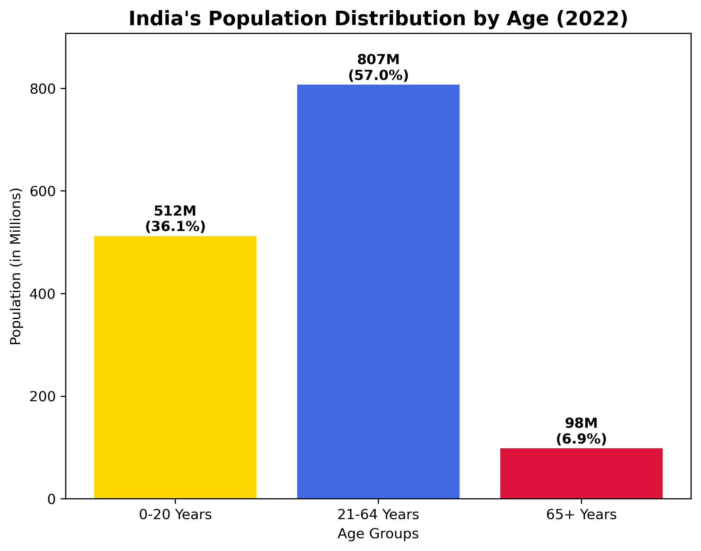
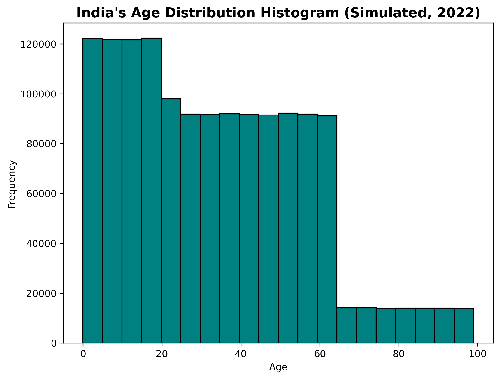

# SCT-DS-1: Population Distribution Visualization

## Task Description
This repository contains my submission for **Task 01** of the Data Science Internship at **SkillCraft Technology**.

**Problem Statement:**
> Create a bar chart or histogram to visualize the distribution of a categorical or continuous variable, such as the distribution of ages or genders in a population.

---

## Dataset
- **Source:** World Bank (API_SP.POP.TOTL_DS2)  
- **Country:** India  
- **Year:** 2022  
- **Total Population:** 1.42 Billion  

**Age group distribution** (from UN World Population Prospects 2022):
- **0–20 Years:** 512M (36.1%)  
- **21–64 Years:** 807M (57.0%)  
- **65+ Years:** 98M (6.9%)  

---

## Tools & Libraries Used
- **Python**
- **Pandas** - Data manipulation and analysis  
- **Matplotlib** - Data visualization  
- **NumPy** - Numerical computing  

---

## Visualizations

### 1. Bar Chart
Shows the population distribution across age groups with clear categorical representation.



### 2. Histogram
Displays simulated continuous age distribution for detailed demographic analysis.



---

## How to Run

1. **Clone the repository:**
   ```bash
   git clone https://github.com/shreyas27092004/sct-ds-1.git
   cd sct-ds-1
   ```

2. **Install dependencies:**
   ```bash
   pip install pandas matplotlib numpy
   ```

3. **Run the Jupyter notebook:**
   ```bash
   jupyter notebook SCT_DS_1.ipynb
   ```

4. **Output:** Images will be saved as:
   - `population_bar_chart.png`
   - `population_histogram.png`

---

## Key Insights

**Young Population Advantage:** India has 36.1% population below 20 years, indicating a strong demographic dividend.

**Large Working Force:** 57% of the population is in the productive age group (21–64 years), supporting economic growth.

**Emerging Aging Trend:** Only 6.9% are 65+ years, but this segment is expected to grow rapidly in coming decades.

**Policy Implications:** The data suggests focus areas for education, employment generation, and future healthcare planning.

---

## Repository Structure
```
sct-ds-1/
│
├── SCT_DS_1.ipynb                  # Main Jupyter notebook
├── dataset.csv                     # Population dataset
├── population_bar_chart.png        # Bar chart visualization
├── population_histogram.png        # Histogram visualization
└── README.md                       # Project documentation
```

---

## Internship Details
- **Company:** SkillCraft Technology  
- **Position:** Data Science Intern  
- **Task:** Task 01 – Population Distribution Visualization  
- **Duration:** 1 month  
- **GitHub:** [@shreyas27092004](https://github.com/shreyas27092004)  

---

## Connect With Me
- **LinkedIn:** [https://www.linkedin.com/in/shreyas-v2709/](https://www.linkedin.com/in/shreyas-v2709/)  
- **Email:** shreyasshreyu405@gmail.com  

---

## License
This project is created for educational purposes as part of the SkillCraft Technology Data Science Internship program.

---

**If you found this project helpful, please consider giving it a star!**
